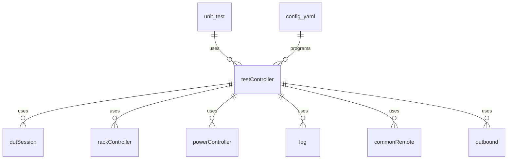
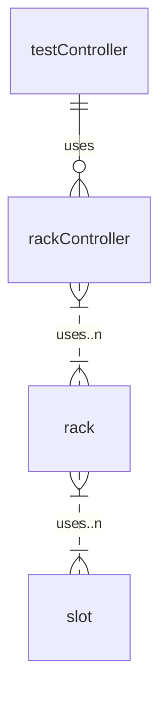
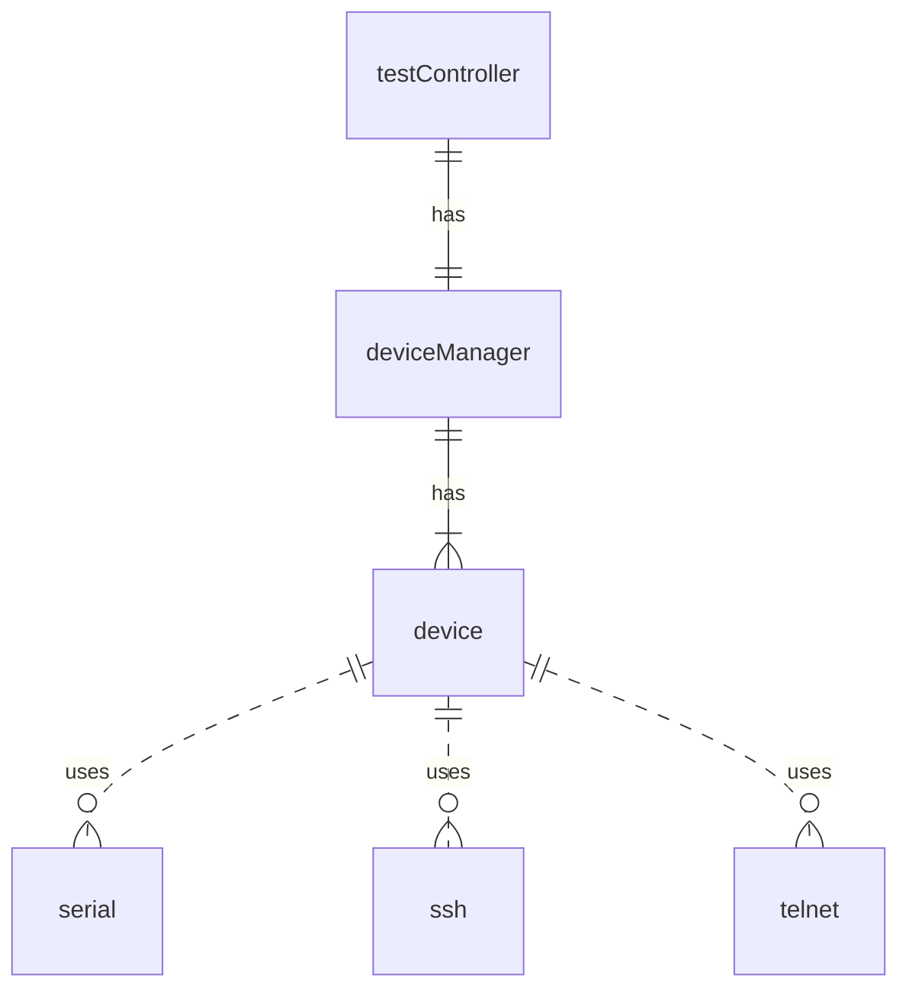
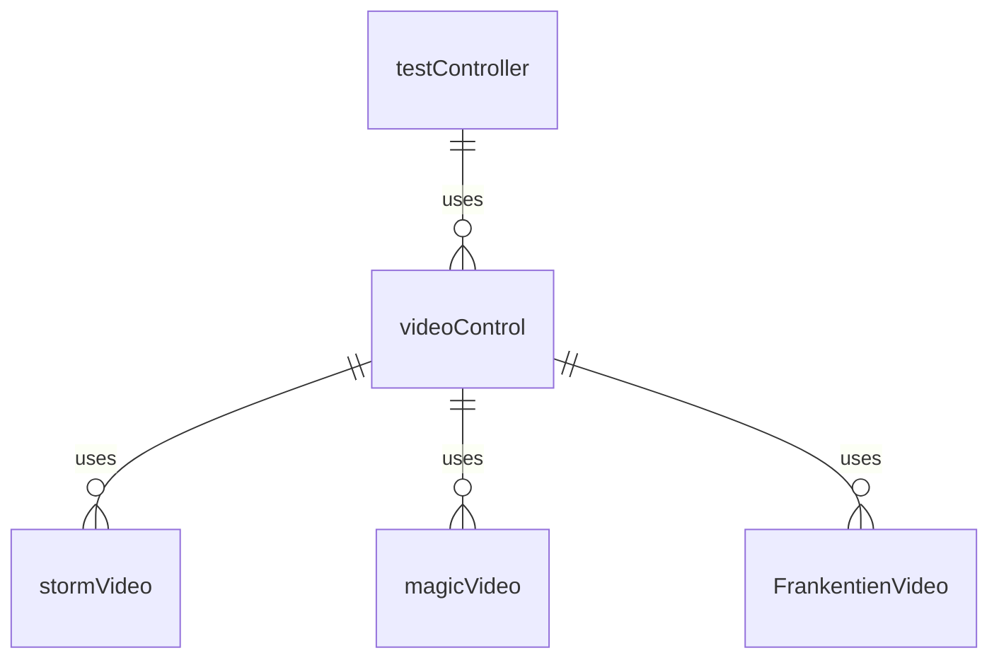
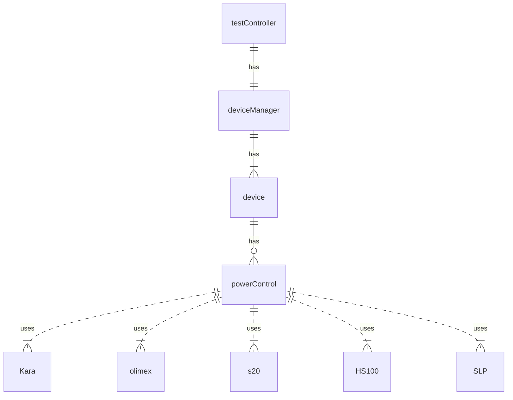
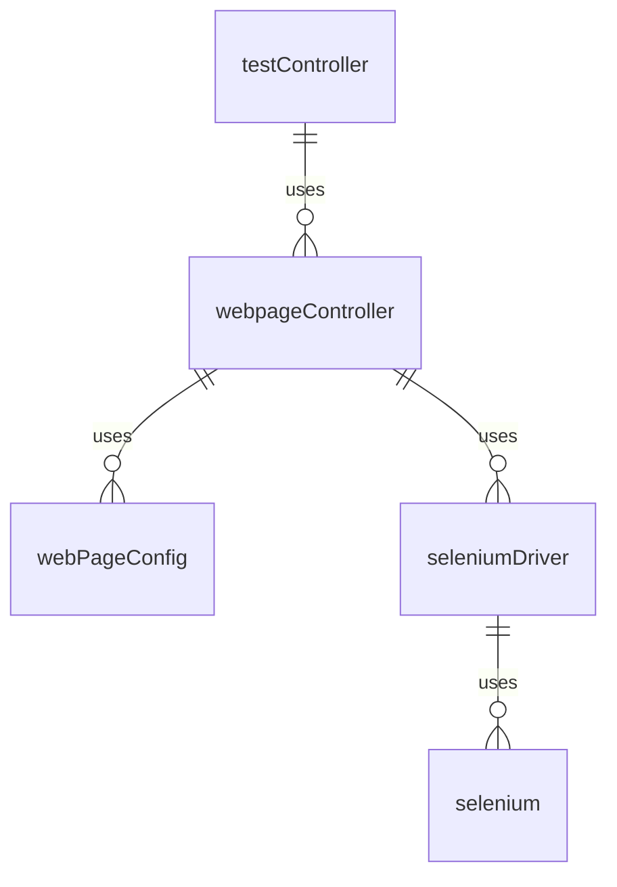

# Class structure of the test System

## Core functionality
This is the class diagram for the main core functionality

## Rack Controller Overview

ClassName: rackController.py

## Console Session Overview

## Test Controller Overview

## Power Controller Overview

## Webpage Controller Overview

