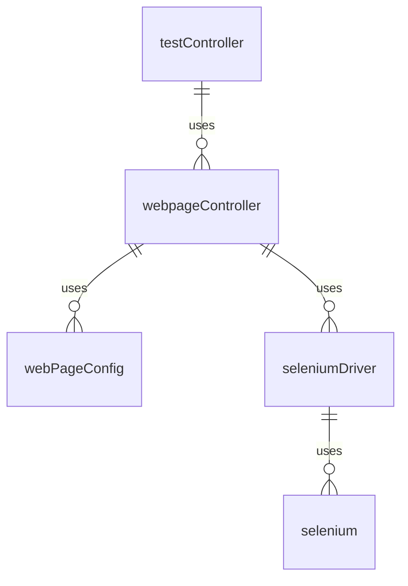

28/04/2022 10:38

# sc test WebpageController Framework (Selenium)


The aim of this framework it to provide a generic and configureable way to interface with webpages and easily automate actions that are commonly performed on them. 

## Requirements
The framework requires a webdriver to correctly function. Currently only the chromewebdriver is implemented using selenium. Please download the webdriver version for whichever version of google chrome is installed.

[https://chromedriver.chromium.org/downloads]

# Design
The framework has been designed with different layers of abstraction. 

The WebpageController class is the highest level of this. It is able to perform actions that are defined in the config file without any extra code, as well as peforming individual interactions and navigating to the different webpages. 

The seleniumDriver class is the next level, it acts as an interface to the selenium code. This is part of the webpageModules folder. If we were to ever switch to using something other than selenium we should be able to implement this by creating a similar interface and switching the webDriver in the WebpageController.

Finally there is the basic selenium code which can still be utilised if needed, however might require more knowledge of what is being done.



When a test is ran the testController creates an instance of the webpageController reading from the rackConfig global config to determine which webDriver to use:
```yml
globalConfig:
    webpageDriver:
        controlType: "selenium"
        supportedBrowser: 'chrome'
        webdriverLocation: '/home/test_user/scTest/chromedriver 2'
```

## webpageController
The webpageController is the class that provides all of the functionality of interacting with the webpage config provided. The public methods and their intended use are listed below.

### configureWebpages(baseUrl, webpageConfig)
This is where the user provides the base url and the webpage config file for the `webpageController` to utilise. This is used to initially configure the `webpageController` and reconfigure if needed.

### setWebpage(pageName)
This will change the `webpageController`'s current page to the once specified. This is intended for use when a redirect has been clicked mid test, and the page the browser is on has changed without the `navigateTo` method being called. It will then validate that all the expected elements exist on the page.

### navigateTo(pageName)
This will change current page to the page passed, as well as actually moving the browser to that page, either by the url_extension if that exists or though using the page's sequence. Once it has landed on the page it will validate that all of the elements that should be visible exist on the page.

### performAction(actionName)
This will perform the action specified from the webpage config.

### performInteraction(interactionName, elementName, args)
This can perform a single [interaction](#interactions) with the webpage based on the name passed.

### getTextOfElement(elementName)
Will return the text of the element.

# Config File
The WebController utilises a config file which represents the webpage to navigate. The config contains information about each webpage, the elements it has, how to naviagte to the page, different views of the page, and actions that can be performed on the page. A full example file is located at the [end](#appendix) of this file.

# Pages
The pages are the highest level of the config file. 
```yml
buffer:
  pages:
    test_locator_page:
      ...
    form_page:
      ...
    form_results_page:
      ...
    
```

The above defines 3 different pages; `test_locator_page`, `form_page` and `form_results_page`

## Elements
Each page config will have a list of web elements in it. Not every element has to be listed within the config, only elements that are to be accessed. These elements can be accessed through several different identifiers.

To access the following element any of the following identifiers can be used. If however any other element shares the same identifiers it will only locate the first element that matches.
```html
<p id="p1" name="pName1" class="normal">
  This is a paragraph text
</p>
```

```yml
  pages:
    test_locator:
      ...
      elements:
        paragraph_a_XPATH:
          type: 'XPATH'
          value: '/html/body/div[2]/p[1]'
        paragraph_a_ID:
          type: 'ID'
          value: 'p1'
        paragraph_a_NAME:
          type: 'NAME'
          value: 'pName1'
        paragraph_a_CLASS_NAME:
          type: 'CLASS_NAME'
          value: 'normal'    
        paragraph_a_TAG_NAME:
          type: 'TAG_NAME'
          value: 'p'      
```

## Views
Views are a way to seperate out different sets of elements which might not always be present on a page. A page does not need to have views, and if no views are provided in the config file it will be assumed that every element listed should be accessible as soon as the test navigates to the page.
If views are used the test will the default view for any elements that do exist when it navigates to a page. Further views can be freely added ontop of this. Each view other than the default requires a sequence to reach this view. These sequences are an [action](#actions)  that the page has.
If a test tries to access an element which belongs to a view and the view is not currently active then the framework will perform the sequence provided to activate the view.

```yml
      views:
        default:
          elements:
            - button0
        view1:
          elements:
            - button1
          sequence: activate_view1
        view2:
          elements:
            - button2
          sequence: activate_view2
        view3:
          elements:
            - button3
          sequence: activate_view3
      elements:
        button0:
          type: 'ID'
          value: 'button00'
        button1:
          type: 'ID'
          value: 'button01'
        button2:
          type: 'ID'
          value: 'button02'
        button3:
          type: 'ID'
          value: 'button03'
      actions:
       activate_view1:
        - click:
            element: button0
       activate_view2:
        - click:
            element: button1
       activate_view3:
        - click:
            element: button2
```

The above represents this [webpage](https://testpages.herokuapp.com/styled/dynamic-buttons-simple.html) which has 4 different buttons, however only one is initially visible. The other buttons appear after the previous one has been clicked. This leads to having several different views, one for each button, with the initial button belonging to the default view.

To access `button3` from the test, the below code would be used:
```
webpageController.getWebElement("button3")
```
The framework in the background will see that `button3` belongs to `view3` and then go through the sequence to activate that view in this case it involves clickling on `button2`. However `button2` is not in the `default` view either, so needs to activate the view it belongs to which is `view2`, similarly this requires  `button1` which belongs to `view1` and requires activating first. 
However from a configuration stand point all the sequence needs to know is the step(s) to activate `view3` from any of the elements that belong to the page.

## Actions
Each page can have a set of actions that can be performed on that page. These actions are made up of a list of interactions that are performed one after another to create an action. 

```yml
    wifi_2.4GHz:
      ...
      elements:
        ssid_input:
          type: 'XPATH'
          value: '/html/body/div[2]/div/div[2]/div[1]/form/div[1]/div[2]/input'
        network_key_input:
          type: 'XPATH'
          value: '/html/body/div[2]/div/div[2]/div[1]/form/div[10]/div[2]/div/input'
        apply_button:
          type: 'XPATH'
          value: '/html/body/div[2]/div/div[2]/div[1]/div/a[2]/span' 
      actions:
        change_ssid_pass:
          - clear:
              element: 'ssid_input'
          - send_keys:
              element: 'ssid_input'
              args: 
                - '$ssid'
          - clear:
              element: 'network_key_input'
          - send_keys:
              element: 'network_key_input'
              args: 
                - 'admin'
          - click:
              element: 'apply_button'
```

The above has defined the `change_ssid_pass` action which is able to change the ssid and the password of a router. To do this it moves through the list of interactions that make up the action. 
1. Clears the input in element `ssid_input`
2. Sends the keys to element  `ssid_input`
3. Clears the input in element `network_key_input`
4. Sends the keys `admin` to elemnt  `network_key_input` 
5. Finally clicksl the element `apply_button`

Where an argument starts with `$` for example in step 2 the args for `send_keys` is `$ssid` the test is expected to provide the argument from within the code. For example the test would call:
```
webpageControl.performAction("change_ssid_pass", ssid="WifiHub")
```

### Interactions
There are a set of interactions that can be used from in the config. These require the appropriate methods to be implemented in the webpageModule, which the seleniumDriver class currently does. The following are the available interactions and how to use them.
```yml
  send_keys:
    element: 'username_input'
    args:
      keys: 'admin'
  click:
    element: 'submit_button'
  accept_alert:
  clear:
    element: 'filled_input'
  refresh:
  select:
    element: 'dropdown_input'
    args:
      selectVal: 'valFromDropdown'
```

As stated in [actions](#actions) if an arg starts with `$` it will expect to be substituted.
## Navigation
There are two different ways to be able to navigate to a page. The first is through a url extension that is added onto the base url of the webpageController. The second is through a sequence of steps to take to get to that page.

### Url Extension
Having a url extension is the simpiliest way to access a page, and atleast one page in the config will require this, otherwise there is no starting point for any pages that utilise the sequence method. The extension is simply appended to the end of the base url.

```yml
    index_page:
      url_extension: '/index.html'
      elements:
        link_to_redirect_page:
          type: 'ID'
          value: 'redirecttest'

```

Above shows the `index_page` with the extension of `/index.html`

### Sequence
The alternative to using a url extension is a sequence action that navigates to the desired page, from another previous page. The sequence describes which page and action on the page to perform to get to the current page 
```yml
    index_page:
      url_extension: '/index.html'
      elements:
        link_to_redirect_page:
          type: 'ID'
          value: 'redirecttest'
      actions:
        go_to_redirect_page:
          - click:
              element: link_to_redirect_page

    redirect_page:
      sequence:
        index_page: go_to_redirect_page
      elements:
        link_to_final_page:
          type: 'ID'
          value: 'delaygotobasic'
      actions:
        go_to_final_page:
          - click:
              element: link_to_sfinal_page

    final_page:
      sequence:
        redirect_page: go_to_final_page
      elements:
        content:
          type: 'XPATH'
          value: '/html/body/div/div[2]/p'
```
The above shows 3 pages, `index_page` which has a url extension, `redirect_page` and `final_page` which both have sequences to get to them. From a sequences point of view it only needs to know the step to get to the desired page from a previous page, it does not care how it gets to the previous page. This means that these sequnces can be chained together.
To get to `final_page` I would call:
```
webpageController.navigateTo("final_page")
```
The framework would see that `final_page` does not have a url_extension and instead it will perform the sequence to navigate to it. This sequence is from `redirect_page` and involves clicking on element `link_to_final_page`. Therefore the framework will navigate to `redirect_page` and click on that element, however `redirect_page` does not have a url_extension, so will perform the sequence to nagivate to that page first.
Similar to view sequences this allows for these sequences to be chained together, however from a configuration point of view, it only needs to know the step(s) from the previous page.

# Global Actions
Global actions can be accessed from anywhere, these actions do not require the test to already have navigated to a certain webpage. These allow actions that act across multiple pages to be defined. Creating a set of methods that will always be accessible. These actions have a list of pages, and then the corresponding action to perform on that page.

```yml
  global_actions:
    alert_action:
    - alerts_page: "create_alert_confirm"
    - form_page: "fill_form"
```

Global actions are defined alongside pages in the yml file, rather than inside pages. `alert_action` will first navigate to the `alters_page` and perform the action `create_alert_confirm`. It will then navigate to the `form_page` and perform the action `fill_form`

# Appendix
## Config File
Config file used for the webpageController tests. 
```yml
buffer:
  pages:
    test_locator:
      url_extension: '/find-by-playground-test.html'
      elements:
        paragraph_a_XPATH:
          type: 'XPATH'
          value: '/html/body/div[2]/p[1]'
        paragraph_a_ID:
          type: 'ID'
          value: 'p1'
        paragraph_a_NAME:
          type: 'NAME'
          value: 'pName1'
        paragraph_a_CLASS_NAME:
          type: 'CLASS_NAME'
          value: 'normal'    
        paragraph_a_TAG_NAME:
          type: 'TAG_NAME'
          value: 'p'      
          
    form_page:
      url_extension: '/basic-html-form-test.html'
      elements:
        username_input:
          type: 'XPATH'
          value: '/html/body/div/div[3]/form/table/tbody/tr[1]/td/input'
        password_input:
          type: 'XPATH'
          value: '/html/body/div/div[3]/form/table/tbody/tr[2]/td/input'
        file_upload:
          type: 'XPATH'
          value: '/html/body/div/div[3]/form/table/tbody/tr[4]/td/input[1]'
        checkbox_2:
          type: 'XPATH'
          value: '/html/body/div/div[3]/form/table/tbody/tr[5]/td/input[2]'
        radio_button_3:
          type: 'XPATH'
          value: '/html/body/div/div[3]/form/table/tbody/tr[6]/td/input[3]'
        multi_select:
          type: 'XPATH'
          value: '/html/body/div/div[3]/form/table/tbody/tr[7]/td/select'
        dropdown_select:
          type: 'XPATH'
          value: '/html/body/div/div[3]/form/table/tbody/tr[8]/td/select'
        submit_button:
          type: 'XPATH'
          value: '/html/body/div/div[3]/form/table/tbody/tr[9]/td/input[2]'
      actions:
        fill_form:
          - send_keys:
              element: 'username_input'
              args: 
                keys: admin
          - send_keys:
              element: 'password_input'
              args: 
                keys: $password
          - send_keys:
              element: 'file_upload'
              args: 
                keys: $path
          - click:  
              element: 'checkbox_2'   
          - click:  
              element: 'radio_button_3'   
          - select:
              element: 'multi_select'
              args: 
                selectVal: $multi_1     
          - select:
              element: 'multi_select'
              args: 
                selectVal: $multi_2  
          - select:
              element: 'dropdown_select'
              args: 
                selectVal: $dropdown           
          - click:
              element: 'submit_button'

    form_results_page:
      elements:
        username_value:
          type: 'ID'
          value: '_valueusername'
        password_value:
          type: 'ID'
          value: '_valuepassword'
        filename_value:
          type: 'ID'
          value: '_valuefilename'
        checkbox_1_value:
          type: 'ID'
          value: '_valuecheckboxes0'
        checkbox_2_value:
          type: 'ID'
          value: '_valuecheckboxes1'
        radio_button_value:
          type: 'ID'
          value: '_valueradioval'
        multiselect_1_value:
          type: 'ID'
          value: '_valuemultipleselect0'
        multiselect_2_value:
          type: 'ID'
          value: '_valuemultipleselect1'
        dropdown_value:
          type: 'ID'
          value: '_valuedropdown'

    dynamic_buttons_page:
      url_extension: '/dynamic-buttons-simple.html'
      views:
        default:
          elements:
            - button0
        view1:
          elements:
            - button1
          sequence: activate_view1
        view2:
          elements:
            - button2
          sequence: activate_view2
        view3:
          elements:
            - button3
          sequence: activate_view3
      elements:
        button0:
          type: 'ID'
          value: 'button00'
        button1:
          type: 'ID'
          value: 'button01'
        button2:
          type: 'ID'
          value: 'button02'
        button3:
          type: 'ID'
          value: 'button03'
      actions:
       activate_view1:
        - click:
            element: button0
       activate_view2:
        - click:
            element: button1
       activate_view3:
        - click:
            element: button2

    index_page:
      url_extension: '/index.html'
      elements:
        link_to_redirect_page:
          type: 'ID'
          value: 'redirecttest'
      actions:
        go_to_redirect_page:
          - click:
              element: link_to_redirect_page

    redirect_page:
      sequence:
        index_page: go_to_redirect_page
      elements:
        link_to_sequence_page:
          type: 'ID'
          value: 'delaygotobasic'
      actions:
        go_to_sequence_page:
          - click:
              element: link_to_sequence_page

    sequence_page:
      sequence:
        redirect_page: go_to_sequence_page
      elements:
        content:
          type: 'XPATH'
          value: '/html/body/div/div[2]/p'

    alerts_page:
      url_extension: '/alerts/alert-test.html'
      elements:
        alert_button:
          type: 'ID'
          value: 'alertexamples'
      actions:  
        create_alert_confirm:
          - click:
              element: alert_button
          - accept_alert:
  global_actions:
    alert_action:
    - alerts_page: "create_alert_confirm"
    - form_page: "fill_form"
```